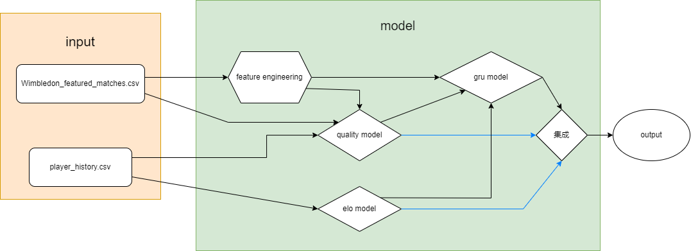

# 2024美赛C题建模
C题题目：[中文版翻译！](https://www.zhihu.com/question/642162681/answer/3384360864)
## 1. 模型架构

这是我们基础模型的架构图，我们现在还没有考虑模型的泛化能力和experiment部分，蓝色的箭头为可选
### 1.1 输入格式
- 我们总共使用了两个数据集，一个是题目附的原始数据集，同时，我们下载了详细的网球排名积分作为输入

### 1.2 输出格式
- 我们希望通过模型实现一个回归任务，最终可以输出一个球员赢得这一分的概率，我们将这个概率定义为了momentum

### 1.3 特征工程
- 我们首先对特征进行了分类，和体力、球员习惯/技术相关的数据为一组，和当前场上形势相关的数据为另一组，第一组作为quality模型的输入，第二组作为momentum模型的输入
- 同时，我们用机器学习方法分析了特征重要性，对强特征做了特征增强，提取可能的非线性关系

### 1.4 模型
#### 1.4.1 quality模型
- quality模型因人而异，我们使用原始的数据，对于每一名球员建模了他的发球速度和跑动定义为他的体力（有论文支撑），通过计算，每一个时刻都可以获得一个正则化过的二元向量，代表了双方的体力分数

#### 1.4.2 elo模型
- elo模型获取球员的排名积分作为初始输入，在每一局结束后会更新积分，每个时刻都对应了一个正则化后的二元向量，代表了双方的实力分数

#### 1.4.3 GRU模型
- 在处理有时序逻辑的数据时，由于transformer复杂度过高，且找到论文证明GRU的效果比LSTM更好，我们直接调用了pytorch中的GRU模型，作为我们的momentum模型的核心，使用Adam优化器和交叉熵损失函数，训练10个epoch之后，我们的模型得到了比较不错的预测效果
- GRU不仅接受处理后的数据作为输入，同时elo和quality模型的输出也作为了GRU的输入，我们认为这样可以更好地定义局势

### 1.5 模型集成
- （这一步我们还没有做，我们不知道直接使用GRU的输出是否合理，体力和实力是两个很强的特征，不知道在这里做集成增强一下数据会不会有更好的效果）
- 集成的方法我现在的构思是freeze掉前面三个模型，在最后做一个FC层，将三个模型的输出拼接在一起，得到一个概率作为最后的输出

## 2. 补充说明
- 有一些很难编码实现的想法，我们不打算放到模型中，反而使用口述的方式在论文中说明。比如天气的影响、球员的心理状态等等，我们不实现他们的原因是因为不具有相应的数据
- 我是计算机专业的学生，所以描述可能更计算机一些，有一些数学的细节是另一个同学去做，比如统计学上的分析等等，这些方面也有可能会有问题

## 3. 现在的问题
- 不清楚这个架构是否合理，我自己把这个任务当成一个小的科研任务在做，所以比较在意它的novelty，不知道这个模型是否将任务考虑全面了，且是否“贴切”这个任务
- robustness和ablation study的问题，我没有做过相关的图，学术界在完成论文时一般会用什么软件作图？
- 毕竟是一个数学建模比赛，怕整个模型的数学性质不够好，不知道有没有什么数学上的trick可以用